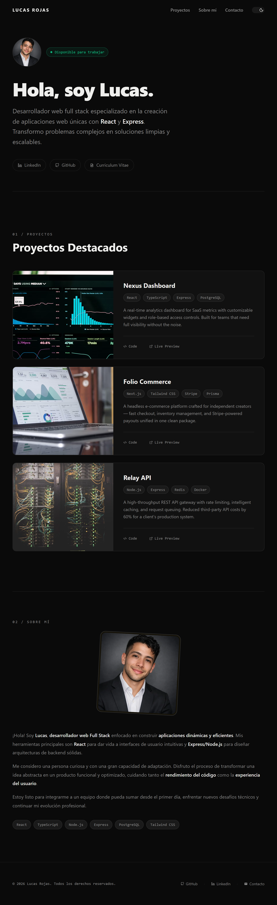

# 🌐 Mi Portafolio Web Personal

¡Hola! Este es el repositorio de mi portafolio personal, diseñado para mostrar mis proyectos, mi stack tecnológico y mi evolución como desarrollador web Full Stack.

El sitio está diseñado con un enfoque **ultra-minimalista, limpio y optimizado para Dark Mode**, poniendo todo el foco en la legibilidad y la experiencia del usuario.

👉 **[Ver mi portafolio en vivo](https://tu-dominio.dev)**

---

## 📸 Vista Previa



## ✨ Características de la Web

- 🌓 **Diseño Dark Mode:** Estética visual oscura optimizada para desarrolladores, con tipografía de alta legibilidad.
- 📱 **100% Responsivo:** Adaptado meticulosamente para dispositivos móviles, tablets y pantallas de escritorio mediante un sistema de rejilla fluido.
- ⚡ **Alto Rendimiento:** Estructura ligera utilizando Vite para garantizar tiempos de carga instantáneos y un buen SEO.

## 🛠️ Tecnologías y Herramientas Utilizadas

- **React.js** (Frontend library)
- **Vite** (Build tool rápido y moderno)
- **Tailwind CSS** (Framework de estilos enfocado en utilidades)
- **Lucide React / Componentes de UI** (Iconografía limpia)

## 🏗️ Estructura del Proyecto

El código está organizado de manera modular para facilitar el mantenimiento y la adición de nuevos proyectos en el futuro:

```text
src/
├── components/     # Componentes reutilizables ( Navbar, Footer)
├── sections/       # Secciones principales (Hero, Projects, AboutMe, ExperienceTimeLine)
├── assets/         # Imágenes
├── App.tsx         # Componente principal que orquesta las secciones
└── main.tsx        # Punto de entrada de la aplicación
```

## 📬 Contacto

Si eres un reclutador, un desarrollador senior o simplemente quieres charlar sobre tecnología, no dudes en escribirme:

**📧 Email:** contacto.lucasdev@gmail.com
**💼 LinkedIn:** https://www.linkedin.com/in/lucas-rojas-553bb5276/
**🖥️ GitHub:**: [Lucas Rojas](https://github.com/Lucas-Rojas-Nahuel)

¡Gracias por visitar Grano Urbano! ☕✨
